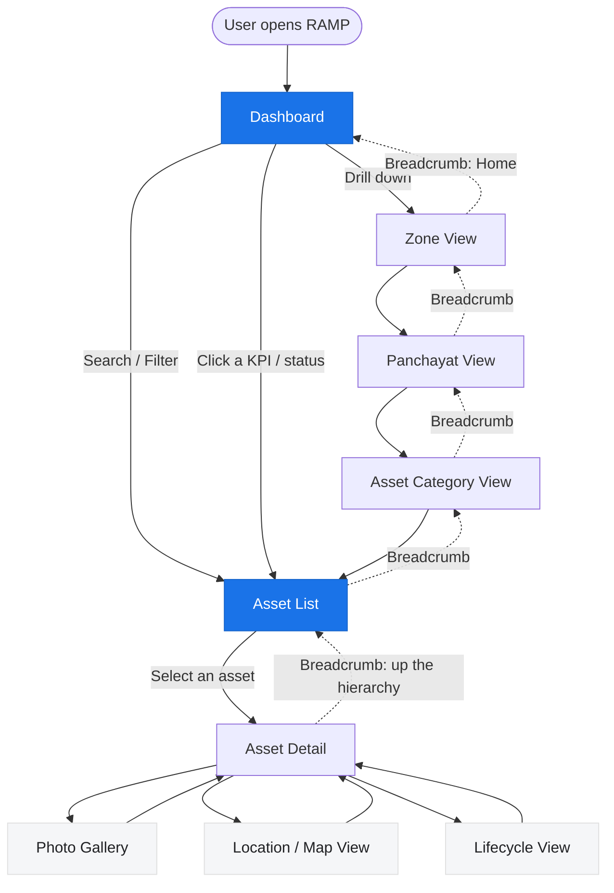
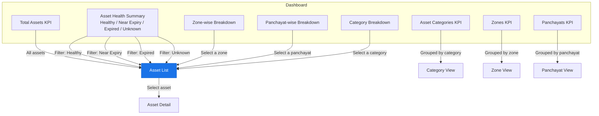
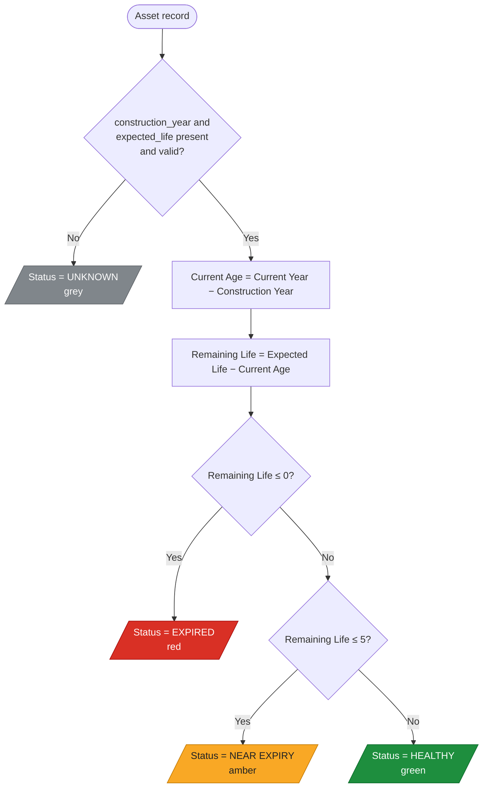
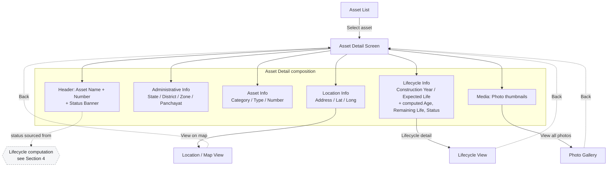
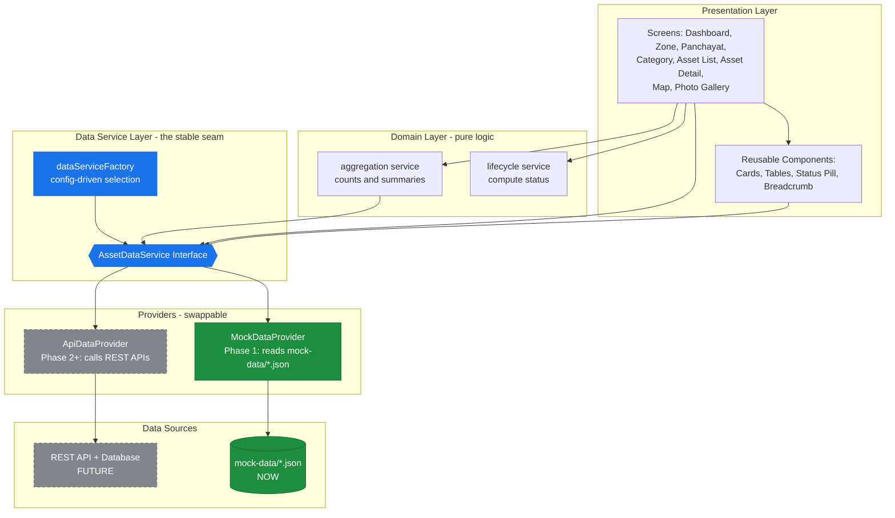

# System Flow Diagrams — RAMP

| Field | Value |
|---|---|
| Document ID | RAMP-DOC-12 |
| Document Title | System Flow Diagrams |
| Version | 1.0 |
| Status | Draft (POC) |
| Audience | Developers, Architects, Product Owner, Future Claude (AI) sessions |
| Related Documents | 03-FRS, 04-Screen Flow, 07-Business Rules, 08-Mock Data, 10-Claude Development Guide, 11-UI/UX |

---

## 1. Purpose

This document captures the **behavioral and structural flows** of the RAMP POC as Mermaid diagrams. They are the visual companion to the textual specifications in Docs 03, 04, and 07, and to the architecture in Doc 10.

The diagrams cover:

1. **User Journey** — the end-to-end path a user takes through the platform.
2. **Dashboard Navigation** — how Dashboard aggregates drill down into detail.
3. **Asset Lifecycle** — how lifecycle status is computed from raw inputs.
4. **Asset Detail Flow** — the structure and sub-views of a single asset.
5. **Future System Architecture** — how the mock-now / API-later data layer is organized.

> **Rendering note:** These are [Mermaid](https://mermaid.js.org/) diagrams. They render natively in most Markdown viewers (GitHub, VS Code with a Mermaid extension, many docs tools). If a viewer does not render Mermaid, the fenced code is still readable as structured text.

---

## 2. User Journey

The canonical journey moves from the Dashboard down the administrative hierarchy to a single asset, then into that asset's sub-views (Photos, Location, Lifecycle). Search and Filter provide a shortcut directly into the Asset List.

**Reading the diagram**

- **Solid arrows** = forward drill-down actions.
- **Dotted arrows** = reverse navigation via breadcrumbs (always available — see Doc 11, §5.2).
- The **Dashboard** and **Asset List** (highlighted) are hubs: multiple paths converge on the Asset List, and every screen can return Home.

---

## 3. Dashboard Navigation

The Dashboard is a set of aggregates, each of which is a **drill-down doorway** into a filtered Asset List. Counts and summaries are produced by the aggregation service (Doc 10) over mock data (Doc 08).

**Key rules reflected here**

- Every aggregate (KPI, health segment, breakdown row) leads somewhere — no number is a dead-end (Doc 11, DP-05).
- Selecting a **health status** applies that status as a filter on the Asset List.
- All breakdowns ultimately funnel to the **Asset List**, then to **Asset Detail**.

---

## 4. Asset Lifecycle

Lifecycle status is **always computed, never stored** (Doc 07). This flow shows the exact decision order — including validation of inputs and the boundary conditions (Remaining Life of 5 → Near Expiry; Remaining Life of 0 → Expired).

**Decision order (must be implemented exactly)**

1. **Validate inputs first.** If `construction_year` or `expected_life` is missing or invalid → **Unknown**.
2. Compute **Current Age** = Current Year − Construction Year.
3. Compute **Remaining Life** = Expected Life − Current Age.
4. If **Remaining Life ≤ 0** → **Expired**.
5. Else if **Remaining Life ≤ 5** → **Near Expiry** (this captures the boundary value 5).
6. Else → **Healthy**.

> The boundaries are deliberate: a Remaining Life of exactly **5** is **Near Expiry**, and exactly **0** is **Expired**. See worked examples in Doc 07.

---

## 5. Asset Detail Flow

The Asset Detail screen is the anchor for a single asset. It presents administrative, asset, location, lifecycle, and media information, with three sub-views. Status on this screen is rendered from the lifecycle computation in §4.

**Notes**

- The **status banner** in the header is produced by the shared lifecycle service (§4) — never hard-coded.
- **Location**, **Photos**, and **Lifecycle** open as sub-views and return to Detail via breadcrumb/back.
- All fields map directly to the `Asset` and `Photo` entities defined in Doc 06 and populated per Doc 08.

---

## 6. Future System Architecture

This is the architectural promise of the POC: the **UI depends on a stable data-service interface**, not on the data source. Today a `MockDataProvider` reads JSON; tomorrow an `ApiDataProvider` calls real services backed by a database — **with no UI changes**. The provider is chosen by a factory/config switch (Doc 10).

**How the swap works**

| Element | Phase 1 (now) | Phase 2+ (future) |
|---|---|---|
| Data source | `mock-data/*.json` | REST API + database |
| Provider | `MockDataProvider` | `ApiDataProvider` |
| Interface | `AssetDataService` (unchanged) | `AssetDataService` (unchanged) |
| Selection | `dataServiceFactory` returns Mock | `dataServiceFactory` returns Api |
| UI / Domain | **No change** | **No change** |

**Architectural guarantees**

- The **UI never reads JSON directly** and never calls APIs directly — it only talks to `AssetDataService` (Doc 10).
- **Lifecycle status and aggregations live in the domain layer**, independent of the data source, so they behave identically before and after migration.
- Switching providers is a **configuration change** in the factory — the blue "seam" is the only place that knows which provider is live.
- This is what lets the team build the full POC on mock data today while guaranteeing a low-friction path to APIs and a database later.

---

## 7. Diagram-to-Document Traceability

| Diagram | Primary source documents |
|---|---|
| User Journey (§2) | 04-Screen Flow, 11-UI/UX (navigation rules) |
| Dashboard Navigation (§3) | 03-FRS (Dashboard), 08-Mock Data (aggregation expectations), 11-UI/UX (§6) |
| Asset Lifecycle (§4) | 07-Business Rules (lifecycle + health), 06-Data Model |
| Asset Detail Flow (§5) | 03-FRS (Asset Mgmt), 04-Screen Flow, 06-Data Model |
| Future Architecture (§6) | 10-Claude Development Guide (architecture), 09-Roadmap (phases) |

---

*End of Document — RAMP-DOC-12*
